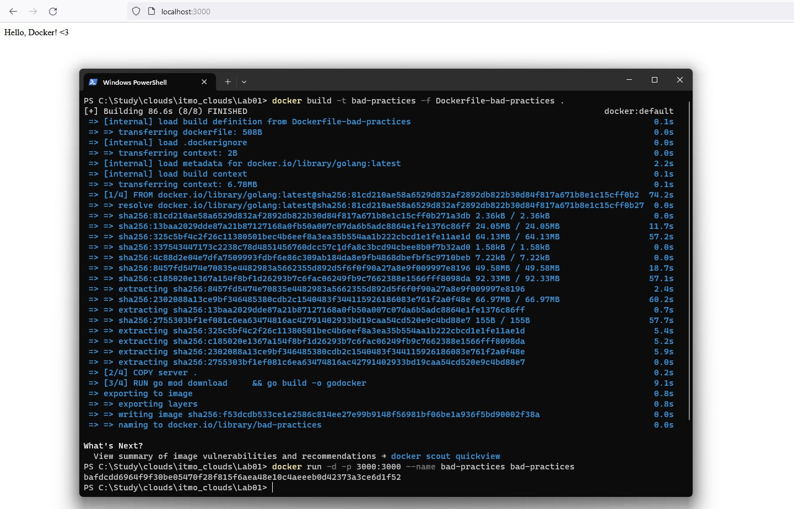
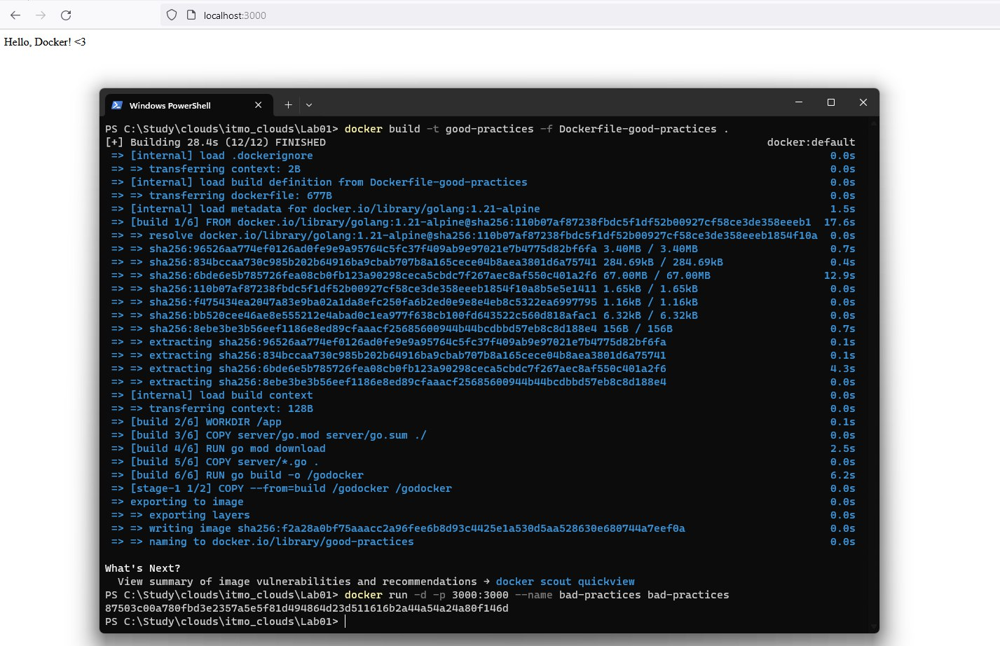
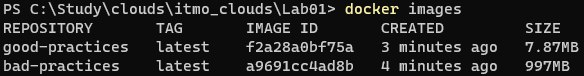

# Лабораторная работа №1 "Работа с Dockerfile"

## Выполнили: 
Бевз Тимофей K34201, Загайнова Кристина K34201, Блохина Анастасия K34201, Балашов Матвей K34201

## Цель работы:
Изучение "плохих" и "хороших" практик при написании Dockerfile.

## Задачи:
* Написание "плохого" Dockerfile, описание "плохих" практик, которые в нём используются
* Написание "хорошего" Dockerfile, в котором "плохие" практики учтены и исправлены
* Описание "плохих" практик по использованию созданных контейнеров  

## Ход работы

### Dockerfile_bad

Сначала был создан файл Dockerfile_bad, в котором были описаны "плохие" практики реализации Dockerfile, которые тем не менее не помешали файлу запускаться.

1.  Не зафиксирована версия исходного образа. Использовать тег "latest" не рекомендуется: так как версии постоянно меняются, при следующем запуске Dockerfile может возникнуть конфликт версий.
```
FROM golang:latest
```

2. Корневая папка выбрана в качестве рабочей. Лучше так не делать, потому что в дальнейшем из-за этого может возникнуть сложность в управлении файлами и структурой каталогов. Это особенно важно для приложений с большим количеством файлов, для которых необходимо сохранять структуру каталогов внутри контейнера. В большинстве случаев рекомендуется выбирать для WORKDIR более специфичный каталог, который будет подходить структуре приложения, что сделает Dockerfile более читаемым и управляемым.

```
WORKDIR /
```

3. В образ скопированы абсолютно все файлы, а не только необходимые. Нужно помнить о том, что память не бесконечна.

```
COPY server .
```

4. Установка зависимостей и построение приложения были произведены в одном слое. Это ухудшает эффективность кэширования.

```
RUN go mod download \
    && go build -o godocker
```

5. Указан открытый порт без протокола и в начале файла. Важно указывать такие параметры в конце файла, т.к. при изменении этого параметра пересборка будет быстрее из-за особенности инструментов кэширования Docker.

* Запуск Dockerfile_bad



### Dockerfile_good

Далее был создан Dockerfile_good, в котором были использованы "хорошие" практики:

1. Была зафиксирована версия образа.

2. Был использован multi-stage подход с легковесным образом scratch.

3. Рабочая папка была отлична от корневой.

4. В образ были скопированы только необходимые файлы.

5. Установку зависимостей и билд были разбиты на два слоя, что обеспечило эффективное кэширование.

6. Был явно указан протокол для порта.

7. Команды были расположены по степени изменяемости: чем чаще меняются, тем ниже в файле располагаются. Это обеспечивает максимальную эффективность инструментов кэширования.

* Запуск хорошего контейнера.



* Список контейнеров



### "Плохие" практики по использованию контейнера

1. Регулярно запускать контейнер от имени администратора (root-пользователя). Делать это рекомендуется только в том случае, когда того требует задача.

2. Отсутствие явно указанного имени при запуске контейнера. Это приводит к тому, что Docker выбирает имя сам, и отличать эти наборы символов друг от друга человеку проблематично.


## Вывод:
В результате выполнения лабораторной работы были изучены "плохие" и "хорошие" практики при создании и запуске Dockerfile. Были созданы два файла: с использованием "плохих" и "хороших" практик, после чего оба файла были запущены. Трудностей в ходе выполнения лабораторной работы не возникло.
