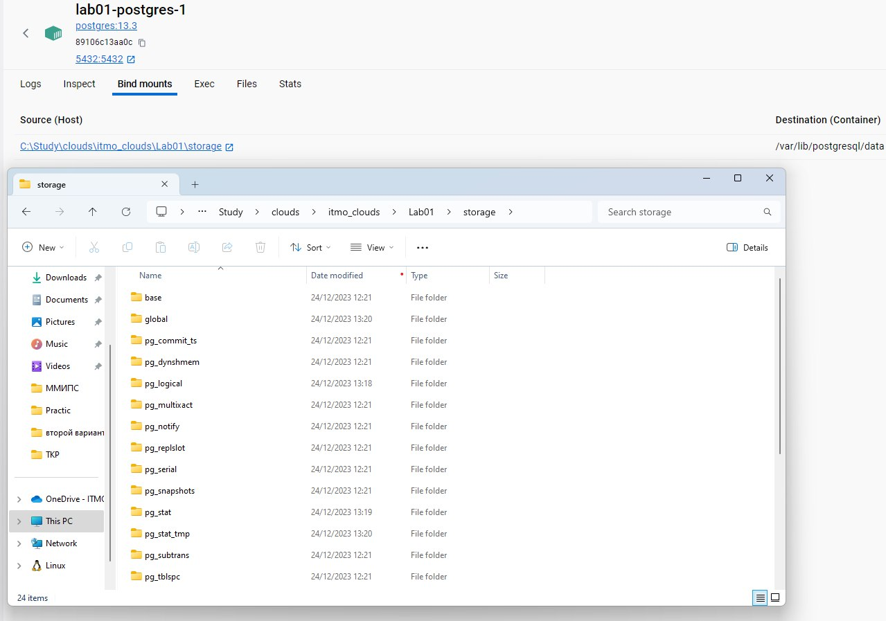
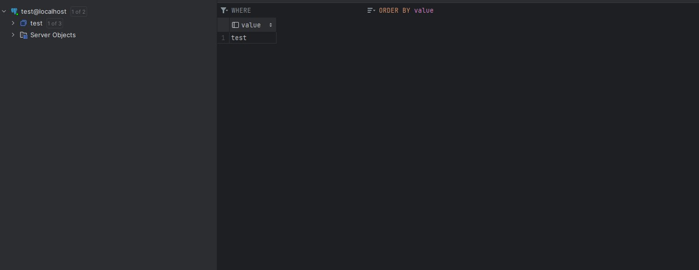
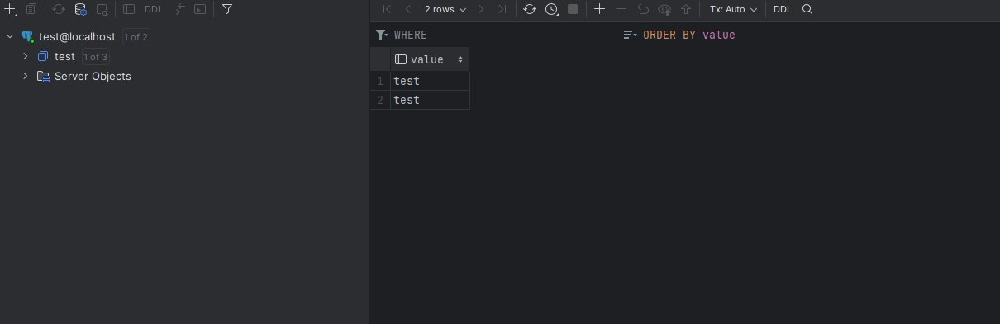

# Лабораторная работа №1* "Работа с Dockerfile"

## Выполнили: 
Бевз Тимофей K34201, Загайнова Кристина K34201, Блохина Анастасия K34201, Балашов Матвей K34201

## Цель работы:
Создание приложения, которое при запуске контейнера записывает изменения в базу данных.

## Задачи:
* Создание приложения, которое записывает в базу данных строку, переданную при запуске контейнера.
* Создание docker-compose файла для сборки контейнера с базой данных.
* Проверка изменений в базе данных  

## Ход работы

### Dockerfile-star


1.  Сначала был создан [Dockerfile-star](https://github.com/T1vz/itmo_clouds/blob/main/Lab01/Dockerfile-star) с самим приложением. При создании использовались "хорошие" практики из первой части работы.
```
FROM golang:1.21-alpine AS build

WORKDIR /app

COPY star_server/go.mod star_server/go.sum ./

RUN go mod download
RUN go mod tidy

COPY server .

RUN go build -o /godocker

FROM scratch

WORKDIR /

COPY --from=build /godocker /godocker

EXPOSE 3000/tcp

ENTRYPOINT ["/godocker"]
```

2.  Затем был создан файл [docker-compose.yml](https://github.com/T1vz/itmo_clouds/blob/main/Lab01/docker-compose.yml) для сборки контейнера с базой данных Postgres. В базу данных передается строка 'test'
```
version: "3.9"
services:
  postgres:
    image: postgres:13.3
    environment:
      POSTGRES_DB: "test"
      POSTGRES_USER: "t1vz"
      POSTGRES_PASSWORD: "1290347856"
    volumes:
      - ./storage:/var/lib/postgresql/data
    ports:
      - "5432:5432"

  app:
    container_name: script
    build:
      context: .
      dockerfile: Dockerfile-star
    environment:
      POSTGRES_DB: "test"
      POSTGRES_USER: "t1vz"
      POSTGRES_PASSWORD: "1290347856"
      POSTGRES_HOST: "postgres"
      POSTGRES_PORT: "5432"
      APP_VALUE: 'test'
    depends_on:
      - postgres
```

3. Ниже представлен локальный репозиторий с файлами базы данных после сборки и запуска docker-compose.yml с помощью следующих команд:

```
docker-compose build

docker-compose up
```

* Локальный репозиторий с БД



4. Ниже представлена выборка из базы данных до запуска контейнера.

* Выборка из БД до запуска контейнера



5. Ниже представлена выборка из базы данных после запуска контейнера. Изменения записались в базу данных успешно и сохранятся при остановке контейнера, так как данные хранятся в базе данных независимо от состояния контейнера.

* Выборка из БД после запуска контейнера




## Вывод:
В результате выполнения второй части первой лабораторной работы было создано приложение, которое при запуске контейнера записывает изменения в базу данных, которая также была развернута с помощью средств Docker.
