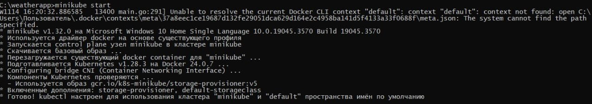
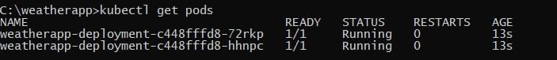
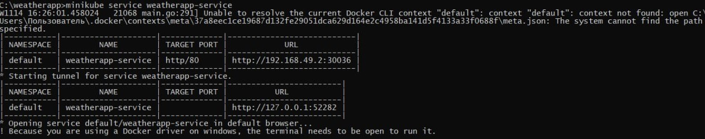
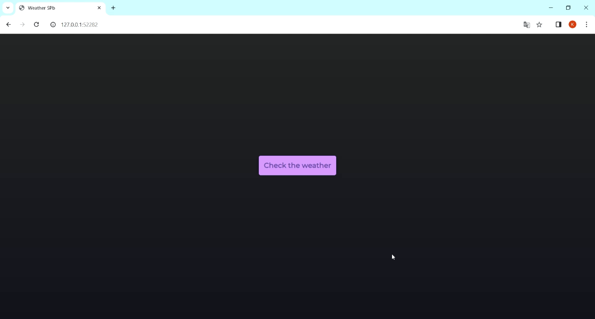

# Лабораторная работа №2 "Работа с Kubernetes"

## Выполнили:

Бевз Тимофей K34201, Загайнова Кристина K34201, Блохина Анастасия K34201, Балашов Матвей K34201

## Цель работы:

Изучение ресурсов Kubernetes и практическое ознакомление с развертыванием приложений в Kubernetes кластере.

## Задачи:

- Поднять Kubernetes кластер локально
- Создать Docker-образ и загрузить его на Docker Hub
- Написать YAML-файлы для развертывания
- Продемонстрировать работоспособность сервиса

## Ход работы

Для работы нам потребуются:

- Docker Engine – для создания образа Docker и контейнеров
- kuberctl – для запуска команд для кластеров Kubernetes
- Minikube – для запуска Kubernetes на локальной машине

### Создание образа

Напишем статический сайт, который будем разворачивать. Внутри директории проекта создадим следующий Dockerfile:

```
FROM nginx:alpine

COPY . /usr/share/nginx/html/

CMD ["nginx", "-g", "daemon off;"]

```

### Работа с minikube

Создадим кластер minikube

> minikube start

<br><br/>

Создадим YAML-файл, в котором опишем Deployment – ресурс Kubernetes, предназначенный для развертывания приложений и их обновления декларативным образом. Он яяляется рекомендуемым способом создания и масштабирования подов

```

apiVersion: apps/v1
kind: Deployment
metadata:
  name: weatherapp-deployment
spec:
  replicas: 2
  selector:
    matchLabels:
      app: weatherapp
  template:
    metadata:
      labels:
        app: weatherapp
    spec:
      containers:
      - name: weatherapp
        image: risen73/weather
        ports:
        - containerPort: 8081

```

В кофигурационном файле мы задали количество реплик (2 штуки) и метки для подов, соответствующих шаблону.

Применим конфигурационный файл развертывания:

> kubectl apply -f deployment.yaml

В нашем кластере запустилось 2 пода:

> kubectl get pods

<br><br/>

По умолчанию под доступен только при обращении по его внутреннему IP-адресу внутри кластера Kubernetes. Чтобы сделать контейнер доступным вне виртуальной сети Kubernetes, необходимо представить под как Service Kubernetes. Создадим YAML-файл, в котором его опишем

```

apiVersion: v1
kind: Service
metadata:
 name: weatherapp-service
spec:
  selector:
    app: weatherapp
  type: NodePort
  ports:
  - name: http
    port: 80
    targetPort: 80
    nodePort: 30036
    protocol: TCP

```

Мы используем тип сервиса NodePort, поскольку он простот в настройке и использовании, а необходимости в масштабировании или равномерном распределении нагрузки у нас нет

Применим:

> kubectl apply -f service.yaml

### Проверка работоспособности

Запустим сервис и и будем надеяться, что все сработает 🤞

> minikube service weatherapp-service

<br><br/>

Откроем браузер. Ура, все работает!

<br><br/>

## Вывод:

В результате выполнения лабораторной работы были изучены ресурсы Kubernetes и получены навыки развертывания приложений в Kubernetes кластере.
