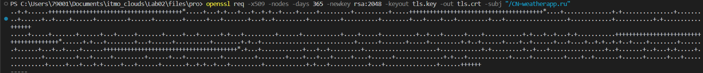
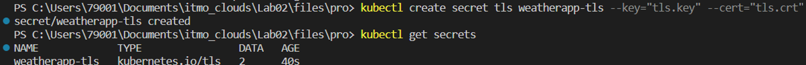
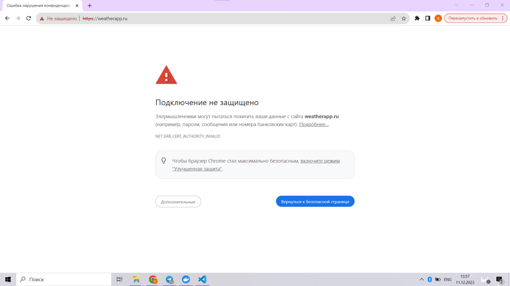
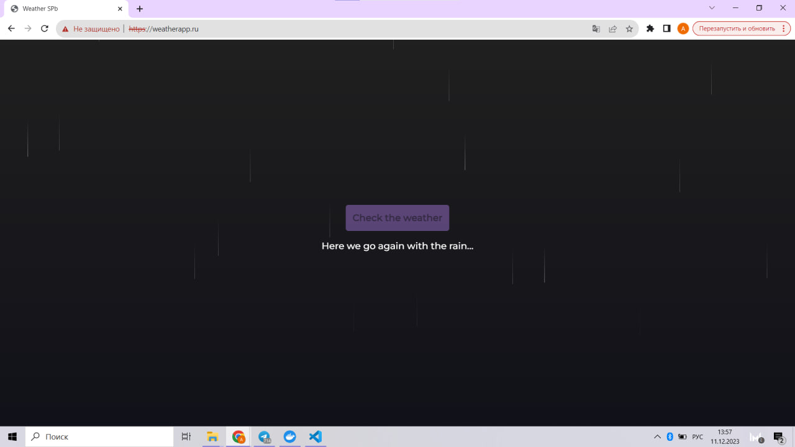
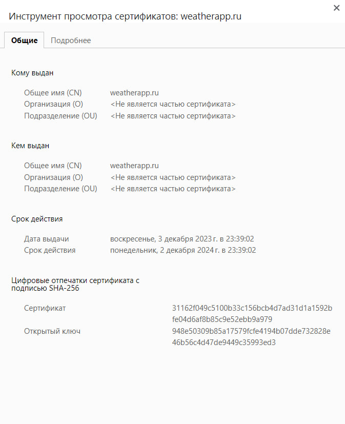

# Лабораторная работа №2 "Работа с Kubernetes"

## Выполнили:

Бевз Тимофей K34201, Загайнова Кристина K34201, Блохина Анастасия K34201, Балашов Матвей K34201

## Цель работы:

Изучение ресурсов Kubernetes и практическое ознакомление с развертыванием приложений в Kubernetes кластере.

## Задачи:

- Поднять Kubernetes кластер локально
- Создать Docker-образ и загрузить его на Docker Hub
- Написать YAML-файлы для развертывания
- Продемонстрировать работоспособность сервиса

## Ход работы

Для работы нам потребуются:

- Docker Engine – для создания образа Docker и контейнеров
- kuberctl – для запуска команд для кластеров Kubernetes
- Minikube – для запуска Kubernetes на локальной машине

### Создание образа

Напишем статический сайт, который будем разворачивать. Внутри директории проекта создадим следующий Dockerfile:

```
FROM nginx:alpine

COPY . /usr/share/nginx/html/

CMD ["nginx", "-g", "daemon off;"]

```

### Работа с minikube

Создадим кластер minikube

> minikube start
> <br><br/>

Создадим YAML-файл, в котором опишем Deployment – ресурс Kubernetes, предназначенный для развертывания приложений и их обновления декларативным образом. Он является рекомендуемым способом создания и масштабирования подов

```

apiVersion: apps/v1
kind: Deployment
metadata:
  name: weatherapp-deployment
spec:
  replicas: 2
  selector:
    matchLabels:
      app: weatherapp
  template:
    metadata:
      labels:
        app: weatherapp
    spec:
      containers:
      - name: weatherapp
        image: risen73/weather
        ports:
        - containerPort: 8081

```

В кофигурационном файле мы задали количество реплик (2 штуки) и метки для подов, соответствующих шаблону.

Применим конфигурационный файл развертывания:

> kubectl apply -f deployment.yaml

В нашем кластере запустилось 2 пода:

> kubectl get pods
> <br><br/>

По умолчанию под доступен только при обращении по его внутреннему IP-адресу внутри кластера Kubernetes. Чтобы сделать контейнер доступным вне виртуальной сети Kubernetes, необходимо представить под как Service Kubernetes. Создадим YAML-файл, в котором его опишем

```

apiVersion: v1
kind: Service
metadata:
 name: weatherapp-service
spec:
  selector:
    app: weatherapp
  type: NodePort
  ports:
  - name: http
    port: 80
    targetPort: 80
    nodePort: 30036
    protocol: TCP

```

Мы используем тип сервиса NodePort, поскольку он простот в настройке и использовании, а необходимости в масштабировании или равномерном распределении нагрузки у нас нет

Применим:

> kubectl apply -f service.yaml

### Проверка работоспособности

Запустим сервис и и будем надеяться, что все сработает 🤞

> minikube service weatherapp-service
> <br><br/>

Откроем браузер. Ура, все работает!
<br><br/>

# ✨ "Использование самоподписанного сертификата" ✨

## Цель работы:

Настроить подключение через HTTPS в k8s-кластере, используя самоподписанный сертификат

## Задачи:

- Сгенерировать самоподписанный сертификат
- Создать секрет TLS
- Написать YAML-файл для Ingress
- Продемонстрировать работоспособность сервиса

## Ход работы

### Создание сертификата

Для генерации самоподписанного сертификата воспользуемся утилитой openssl:

> openssl req -x509 -nodes -days 365 -newkey rsa:2048 -keyout tls.key -out tls.crt -subj "/CN=weatherapp.ru"
> <br><br/>

В результате работы утилиты в текущей папке были созданы два файла: tls.key и
tls.crt (ключ и сертификат соответственно).

Создадим TLS-секрет, для которого в качестве сертификата и ключа укажем созданные ранее файлы:

> kubectl create secret tls weatherapp-tls --key="tls.key" --cert-"tls.crt"
> <br><br/>

### Подключение Ingress

Ingress – это механизм, который обеспечивает маршрутизацию входящего трафика на уровне приложения. Прежде всего активируем соответствующее дополнение:

> minikube addons enable ingress
> <br><br/>

Обратим внимание на строчку про minikube tunnel (мы вот обратили не сразу)

Создадим YAML-файл

```

apiVersion: networking.k8s.io/v1
kind: Ingress

metadata:
  name: weatherapp-ingress
  annotations:
    nginx.ingress.kubernetes.io/ssl-redirect: "true"

spec:
  tls:
    - hosts:
      - weatherapp.ru
      secretName: weatherapp-tls

  rules:
  - host: weatherapp.ru
    http:
      paths:
      - path: "/"
        pathType: Prefix
        backend:
          service:
            name: weatherapp-service
            port:
              number: 80

```

В манифесте мы указали, что все HTTP-запросы должны быть перенаправлены на HTTPS, в спецификации определили один хост - weatherapp.ru и секрет - weatherapp-tls, для хоста определили правила: все все запросы, начинающиеся с /, будут отправлены на сервис weatherapp-service с портом 80.

Применим:

> kubectl apply -f ingress.yaml

### Проверка работоспособности

Вспоминаем про команду minikube tunnel - ее требуется выполнить для доступности наших ресурсов Ingress по адресу 127.0.0.1. Запустим в отдельном терминале:

> minikube tunnel

Также пропишем доменное имя weatherapp и его ip-адрес (в нашем случае 127.0.0.1) в файле hosts.

Можем открывать вкладку в браузере
<br><br/>

На свой страх и риск все-таки переходим на незащищенный ресурс
<br><br/>
<br><br/>
А почему незащищенный?
Как мы выяснили, создавать самоподписанные сертификаты не так уж и сложно, наверное злоумышленники тоже могут такому научиться. Вот браузер сертификату и не доверяет, потому что заверил его не специальный центр.

## Вывод:

В результате выполнения лабораторной работы были изучены ресурсы Kubernetes и получены навыки развертывания приложений в Kubernetes кластере.
