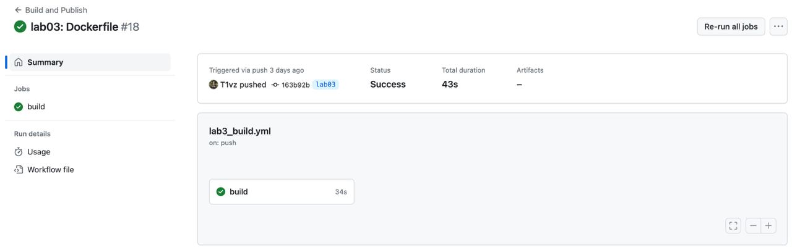
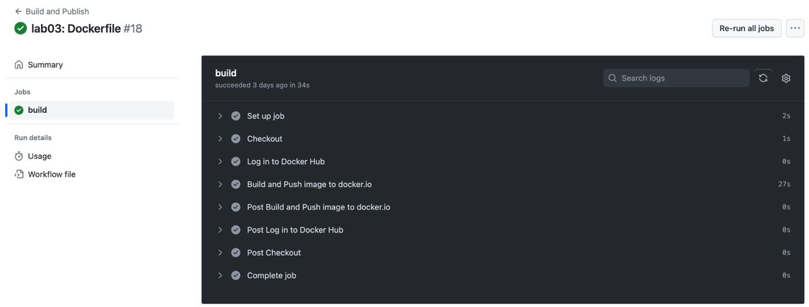
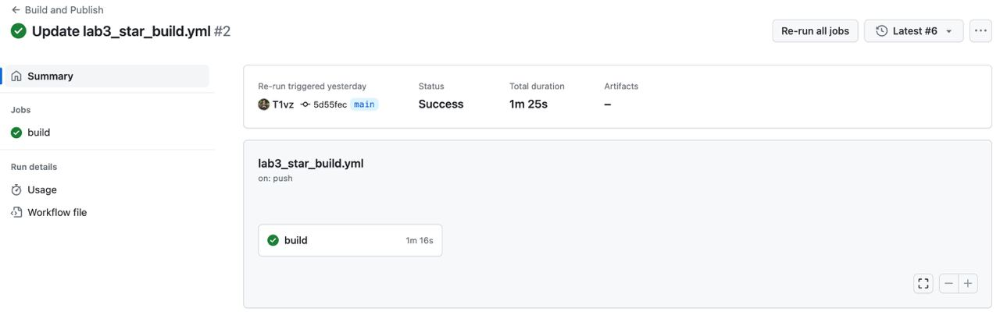
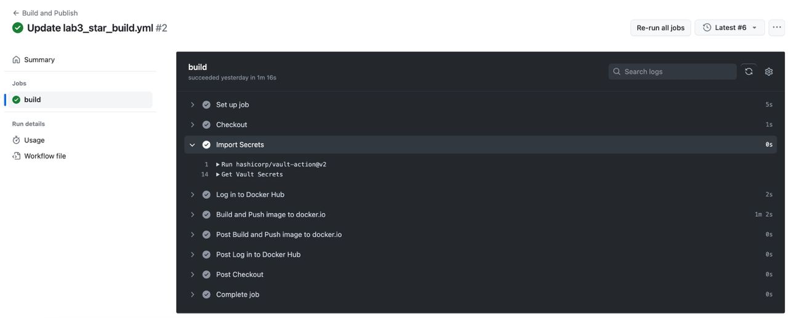

# Лабораторная работа №3 (3*) "Настройка CI/CD"

## Выполнили: 
Бевз Тимофей K34201, Загайнова Кристина K34201, Блохина Анастасия K34201, Балашов Матвей K34201

## Цель работы:
Реализация настроек CI/CD для автоматического запуска и сохранения результата запуска образа Docker после пуша файлов в репозиторий, а также работа с секретами посредством Hashicorp Vault.

## Задачи:
* Настройка CI/CD для автоматизации работы с образами Docker
* Проверка корректности настроек на практике

## Ход работы

### Настройка CI/CD на Github

1.  Ниже представлен код файла [lab3_build.yml](https://github.com/T1vz/itmo_clouds/blob/main/.github/workflows/lab3_star_build.yml) для автоматической сборки и публикации образа Docker без секретов.

```
name: Build and Publish

on:
  push:
    branches: [ "main" ]
    paths:
      - "Lab03/**"

jobs:

  build:
    runs-on: ubuntu-latest
    steps:
      - name: Checkout
        uses: actions/checkout@v3

      - name: Log in to Docker Hub
        uses: docker/login-action@v3
        with:
          username: ${{ secrets.DOCKER_LOGIN }}
          password: ${{ secrets.DOCKER_TOKEN }}

      - name: Build and Push image to docker.io
        uses: docker/build-push-action@v2
        with:
          context: Lab03
          push: true
          tags: ${{ secrets.DOCKER_LOGIN }}/${{ secrets.DOCKER_NAME }}:latest
```

Более подробный разбор кода файла представлен во второй части работы.


2.  Результат сборки на Github. Успех был достигнут с 18 попытки.



* Шаги, выполненные при успешной сборке

  

# "Секреты Hashicorp Vault"

## Цель работы:
Работа с секретами посредством Hashicorp Vault.

## Задачи:
* Настройка автоматического запуска образов Docker и использованием секретов

## Ход работы

### Hashicorp Vault

1.  Сначала по руководству от Github были настроены self runners для автоматического запуска образов Docker.

* Руководство по настройке self runners


2. Список успешно настроенных self runners представлен на рисунке ниже.

* Список self runners


3.  Затем в локальном репозитории был запущен Hashicorp Vault. 

* Запуск Hashicorp Vault


Данные в локальном Vault хранятся в защифрованном виде.

* Данные в локальном Vault


4. Затем в локальном репозитории были проведены попытки запуска настроенных self runners с помощью средств Github Actions.

* Запуск self runners


Среди причин неудач можно выделить следующие:

* Отсутствие Docker на self run машине
* Установка локальных переменных для VAULT (относится ко второй части работы)

5. Ниже представлен разбор файла [lab3_star_build.yml](https://github.com/T1vz/itmo_clouds/blob/main/.github/workflows/lab3_star_build.yml) для автоматической сборки и отправки образа Docker с использованием секретов.

* Имя процесса

```
name: Build and Publish
```

* Ветка и директории, в которой нужно отслеживать изменения
```
on:
  push:
    branches: [ "main" ]
    paths:
      - "Lab03/**"
      - ".github/workflows/**"
```

* Добавление задачи, исполняемой при запуске файла на локальном хосте

```
jobs:

  build:
    runs-on: self-hosted
```
* Шаги запускаемого процесса. Об их назначении можно сделать вывод по названиям: Checkout – переход к репозиторию, Import Secrets – Загрузка секретов с использованием Hashicorp Vault, Log in to Docker Hub – авторизация в Dockerhub с использованием имени пользователя и пароля, Build and Push image to docker.io – сборка и отправка образа на docker.io.

```
    steps:
      - name: Checkout
        uses: actions/checkout@v3

      - name: Import Secrets
        uses: hashicorp/vault-action@v2
        with:
          url: http://127.0.0.1:8200
          tlsSkipVerify: true
          token: ${{ secrets.VAULT_TOKEN }}
          secrets: |
            secret/data/docker * | DOCKER_

      - name: Log in to Docker Hub
        uses: docker/login-action@v3
        with:
          username: ${{ env.DOCKER_LOGIN }}
          password: ${{ env.DOCKER_TOKEN }}

      - name: Build and Push image to docker.io
        uses: docker/build-push-action@v2
        with:
          context: Lab03
          push: true
          tags: ${{ env.DOCKER_LOGIN }}/${{ env.DOCKER_NAME }}:latest
```

6. Ниже продемонстрирован успешный запуск образа.

* Успешный запуск образа


7.  Ниже представлен Access Token для Dockerhub по итогу работы.

* Access Token


8.  Ниже представлены секреты на Github по итогу работы. Для работы self runner во второй части работы был добавлен vault_token.

* Секреты


9. Ниже представлен успешный результат работы self runner на Github для второй части работы.

* Результат запуска self runner



* Шаги запуска self runner



## Выводы:
В результате выполнения лабораторной работы были изучены основы работы с CI/CD на Github, были настроены self runners для автоматического запуска образов Docker, была проведена установка и работа со средствами Hashicorp Vault.
Планируемые результаты были достигнуты.
