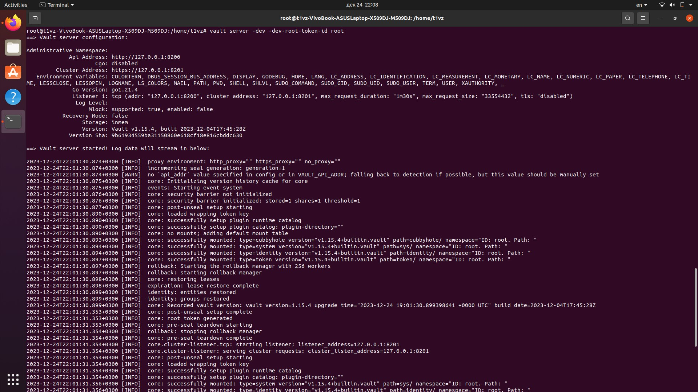
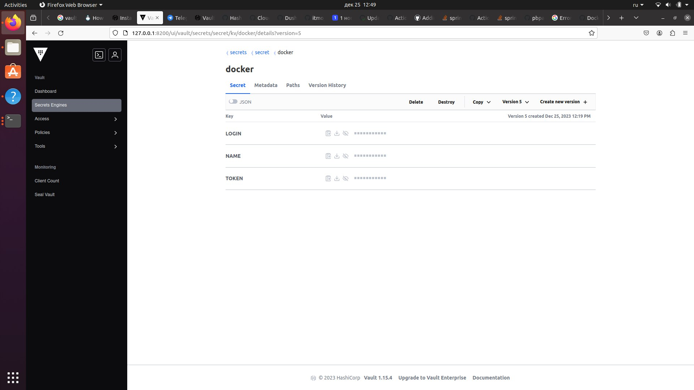
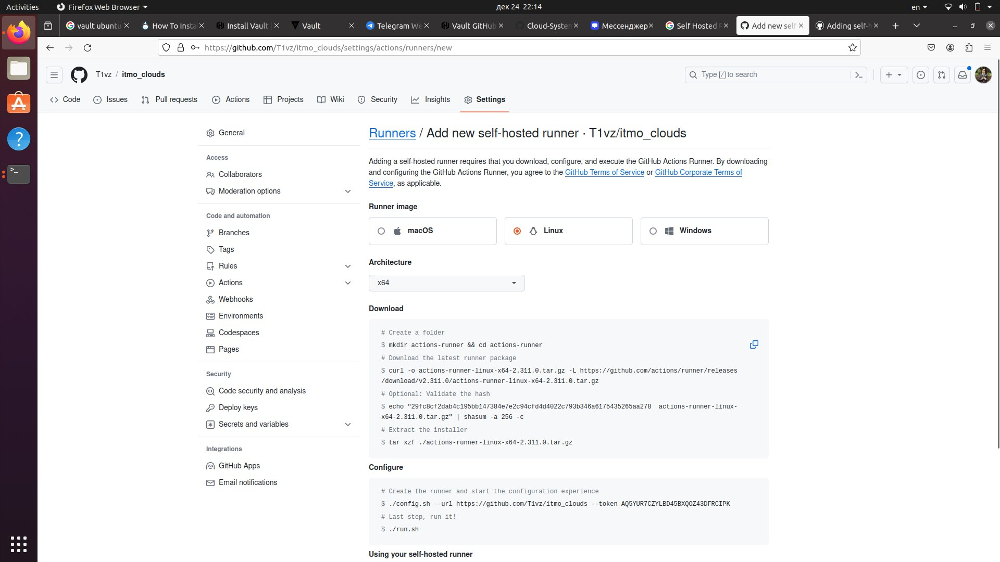
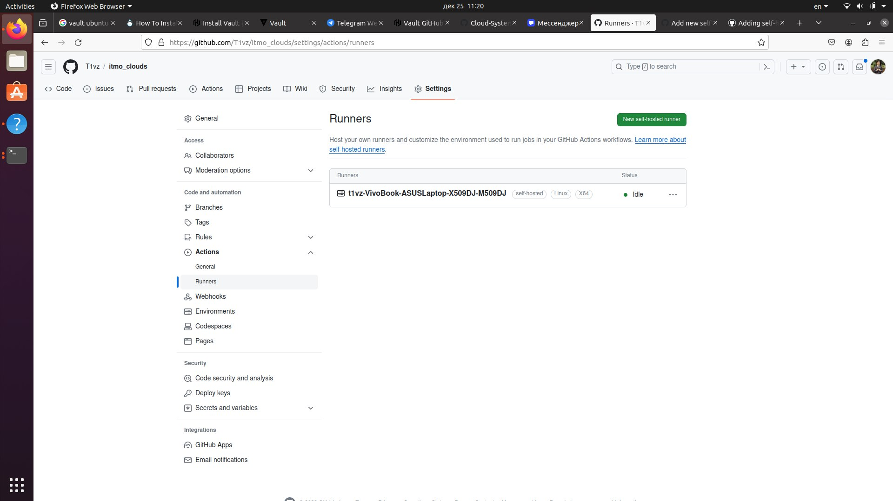
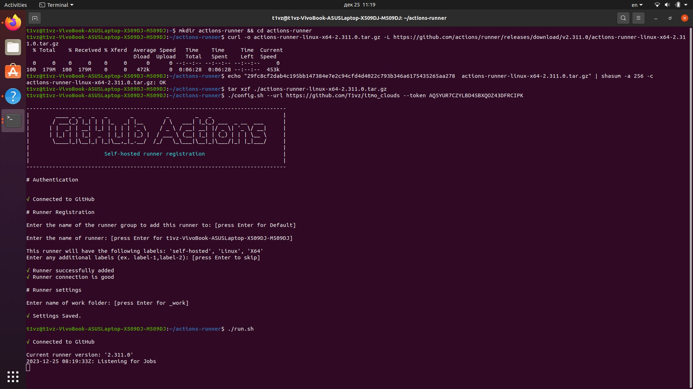
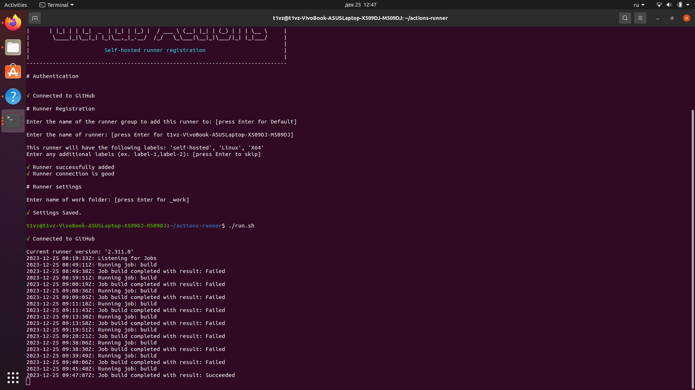
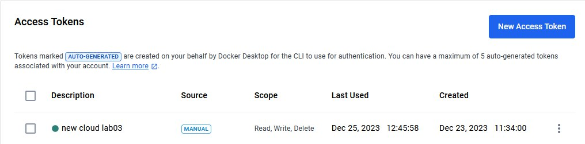
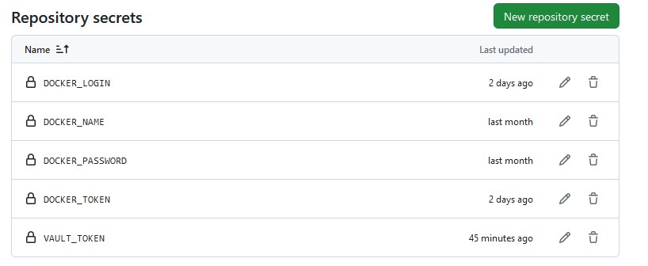

s
# Лабораторная работа №3 (3*) "Настройка CI/CD"

## Выполнили: 
Бевз Тимофей K34201, Загайнова Кристина K34201, Блохина Анастасия K34201, Балашов Матвей K34201

## Цель работы:
Реализация настроек CI/CD для автоматического запуска и сохранения результата запуска образа Docker после пуша файлов в репозиторий, а также работа с секретами посредством Hashicorp Vault.

## Задачи:
* Настройка CI/CD для автоматизации работы с образами Docker
* Проверка работы настроек
* Работа с секретами Hashicorp Vault

## Ход работы

### Настройка CI/CD на Github

1.  Сначала в локальном репозитории был запущен Hashicorp Vault. 

* Запуск Hashicorp Vault

Данные в локальном Vault хранятся в защифрованном виде.

* Данные в локальном Vault

2.  Затем по руководству от Github были настроены self runners для автоматического запуска образов Docker.

* Руководство по настройке self runners

3. Список успешно настроенных self runners представлен на рисунке ниже.

* Руководство по настройке self runners

4. Затем в локальном репозитории были проведены попытки запуска настроенных sekf runners с помощью средств Github Actions.

* Первый запуск образа

Среди причин неудач можно выделить следующие:

* Установка локальных переменных для VAULT
* Отсутствие докера на селфран машине (было пофикшено)

5. После ряда неудач и фикса ошибок удалось достичь успешного запуска образа Docker.

* Успешный запуск образа

6.  Ниже представлен Access Token для Dockerhub по итогу работы.

* Access Token

7.  Ниже представлены секреты в Github по итогу работы.

* Github Secrets

## Вывод:
В результате выполнения лабораторной работы были изучены основы работы с CI/CD на Github, были настроены self runners для автоматического запуска образов Docker, была проведена установка и работа со средствами Hashicorp Vault.
Планируемые результаты были достигнуты.
