# Лабораторная работа №4 "Работа с Prometheus и Grafana"

## Выполнили:

Бевз Тимофей K34201, Загайнова Кристина K34201, Блохина Анастасия K34201, Балашов Матвей K34201

## Цель работы:

Сделать мониторинг сервиса, поднятого в Lab02, с использованием Prometheus и Grafana

## Задачи:

- Установить Prometheus и Grafana
- Настроить Prometheus и Grafana
- Продемонстрировать дашборд

## Ход работы

Для работы нам дополнительно потребуются:

- Chocolatey – для установки helm
- Helm – пакетный менеджер Kubernetes

### Установка Prometheus

Добавим репозиторий prometheus-community

> helm repo add prometheus-community https://prometheus-community.github.io/helm-charts

Из репозитория установим Prometheus и создадим NodePort сервис Kubernetes для Prometheus

> helm install prometheus prometheus-community/prometheus

> kubectl expose service prometheus-server --type=NodePort --target-port=9090 --name=prometheus-server-np

Для проверки команд можем просмотреть все поды, связанные с Prometheus

> kubectl get pods -l app.kubernetes.io/instance=prometheus
> <br>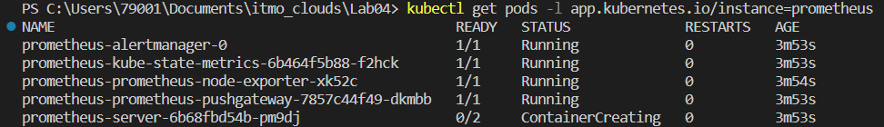<br/>

Для доступа к интерфейсу выполним команду

> minikube service prometheus-server-np

В браузере откроется страничка
<br>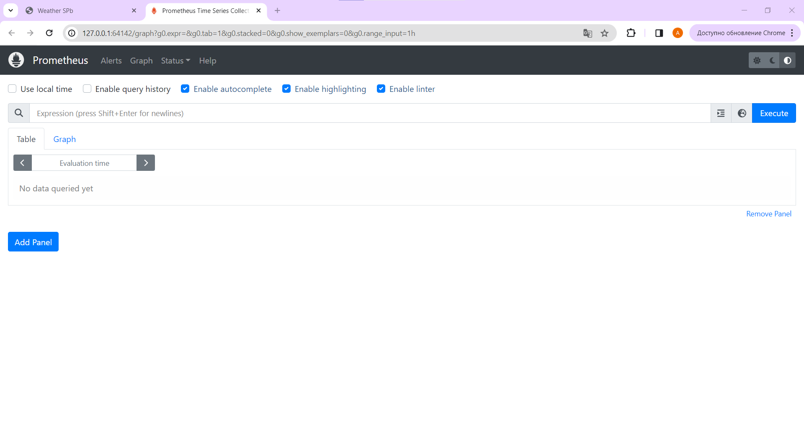<br/>

P.S. При установке нам сообщили, где работает Prometheus, потом это окажется полезным
<br>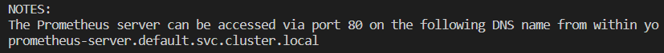<br/>

### Установка Grafana

Как и в случае с Prometheus, добавим репозиторий, установим Grafana, запустим как сервис Kubernetes

> helm repo add grafana https://grafana.github.io/helm-charts

> helm install grafana grafana/grafana

> kubectl expose service grafana --type=NodePort --target-port=3000 --name=grafana-np

При установке нам выпала заметка, что для входа стоит использовать логин _admin_ и пароль, который можно получить, выполнив команду

> kubectl get secret --namespace default grafana -o jsonpath="{.data.admin-password}" | base64 --decode ; echo

На Windows утилита base64 не работает, но есть альтернатива - certutil

Мы записали пароль в файлик и затем его скопировали
<br>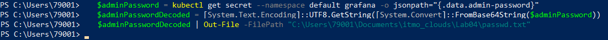<br/>

Запускаем

> minikube service grafana-np

Открывается страничка, куда мы вводим полученные данные
<br>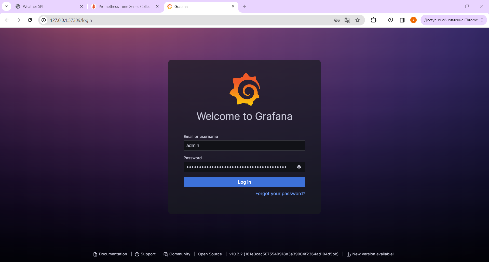<br/>

Вход успешно выполнен
<br><br/>

Осталось связать Grafana с Prometheus. Для этого зайдем в раздел _Connections > Datasources_ и укажем адрес, по которому работает Prometheus
<br>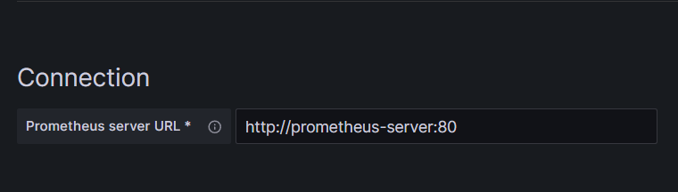<br/>

### Работа с дашбордами

Выберем дашборд среди https://grafana.com/grafana/dashboards/ и укажем его ID при импорте (у нас 11454)

Вот так это все выглядит
<br>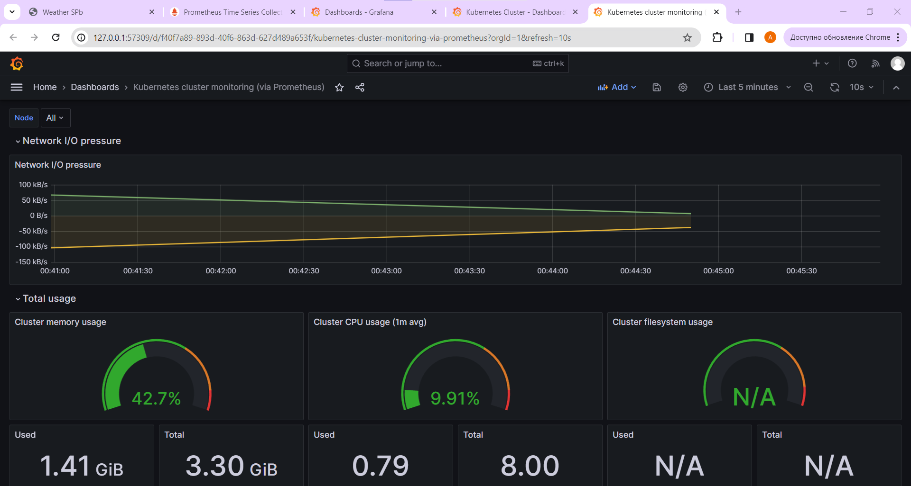<br/>

# ✨ "Настройка алерта кодом" ✨

## Цель работы:

Настроить алерты Grafana в виде кода при помощи Terraform

## Задачи:

- Установить Terraform
- Подключить Terraform к Grafana
- Подготовить стек Grafana Alerting к работе

## Ход работы

Для работы нам дополнительно потребуются использовать VPN для скачивания Terraform и обращения к документации

### Установка и подключение Terraform

Выполним установку при помощи пакетного менеджера Chocolatey

> choco install terraform
> <br>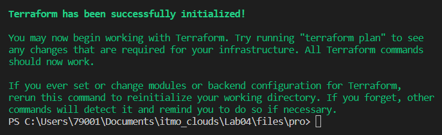<br/>

Создадим сервис Terraform в интерфейсе Grafana
<br>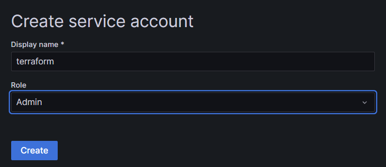<br/>

Сгенерируем для него токен
<br>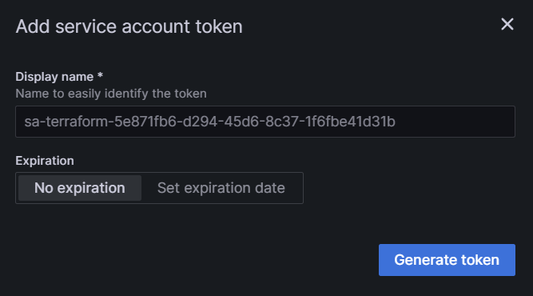<br/>

### Настройка провайдера

В конфигурационном файле Terraform создадим провайдера Grafana, указав необходимые параметры подключения

```
terraform {
    required_providers {
        grafana = {
            source = "grafana/grafana"
        }
    }
}

provider "grafana" {
    url = "http://localhost:65239/"
    auth = "glsa_3mw4KBllmDmIAZmB4yWR9yXsGqz3rV5w_e82e322b"
}

```

Выполним команду

> terraform init

### Настройка контактных точек

Сообщим, куда мы ждем оповещения - в Telegram.

```
resource "grafana_contact_point" "telegram_contact_point" {
  name = "Telegram alerts"

    telegram {
      token    = "6975812664:AAF2cdpF0C5dStHLUfMG6krCkpn_06lQz_A"
      chat_id  = "-4062375569"
    }
}
```

Выполним команду

> terraform apply

В интерфейсе Grafana появилась информация о созданной контактной точке
<br>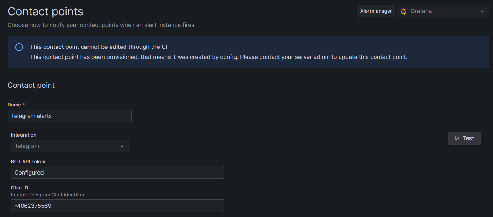<br/>
Можем протестировать правильность работы, нажав кнопку Test. Бот прислал нам сообщение
<br>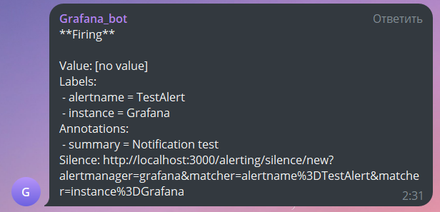<br/>

### Прочая настройка

Дальнейшая часть работы идет туго, потому что ресурсов для изучения немного
<br>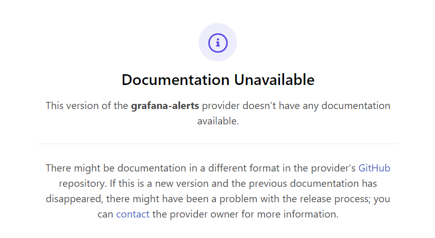<br/>

## Вывод:

В результате выполнения лабораторной работы были изучены ресурсы Prometheus и Grafana, получены дашборды для мониторинга, предприняты попытки работы с Terraform для настройки алертов Grafana кодом
